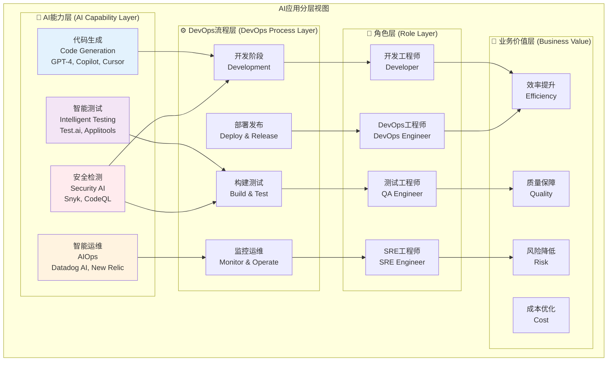

# AI DevOps 分层视图

## 概述
分层视图展示了AI在DevOps中的应用架构，从底层AI能力到上层业务价值的完整映射关系。

## 适用场景
- 技术架构展示
- 向技术团队介绍AI应用架构
- 技术决策讨论
- AI能力规划

## 图表

## 层级说明

### 🤖 AI能力层
基础AI技术能力，为上层应用提供智能化支持：
- **代码生成**: 自动生成代码、注释、文档
- **智能测试**: 自动化测试生成和执行
- **智能运维**: 异常检测、根因分析、自动修复
- **安全检测**: 代码安全扫描、漏洞检测、合规检查

### ⚙️ DevOps流程层
传统DevOps流程的各个阶段：
- **开发阶段**: 需求分析、代码开发、代码审查
- **构建测试**: 持续集成、自动化测试、质量检查
- **部署发布**: 持续部署、环境管理、发布管理
- **监控运维**: 系统监控、性能优化、事故响应

### 👥 角色层
参与DevOps流程的各个角色：
- **开发工程师**: 主要负责代码开发和基础测试
- **测试工程师**: 负责质量保障和测试自动化
- **DevOps工程师**: 负责CI/CD流程和工具链
- **SRE工程师**: 负责生产环境稳定性和可靠性

### 🎯 业务价值层
AI应用带来的业务价值：
- **效率提升**: 减少重复工作，加快开发速度
- **质量保障**: 提高代码质量，减少缺陷
- **成本优化**: 降低人力成本，优化资源使用
- **风险降低**: 提前发现问题，减少生产事故

## 关键洞察

1. **分层解耦**: 各层相对独立，便于技术选型和替换
2. **价值传递**: 底层AI能力最终要体现为业务价值
3. **角色协作**: 不同角色需要协作使用AI工具
4. **能力复用**: 底层AI能力可以服务多个流程阶段

## 应用建议

1. **技术选型**: 基于分层架构进行AI工具评估和选择
2. **能力建设**: 优先建设可复用的底层AI能力
3. **组织协调**: 明确各角色在AI应用中的职责
4. **价值度量**: 建立从AI能力到业务价值的度量体系