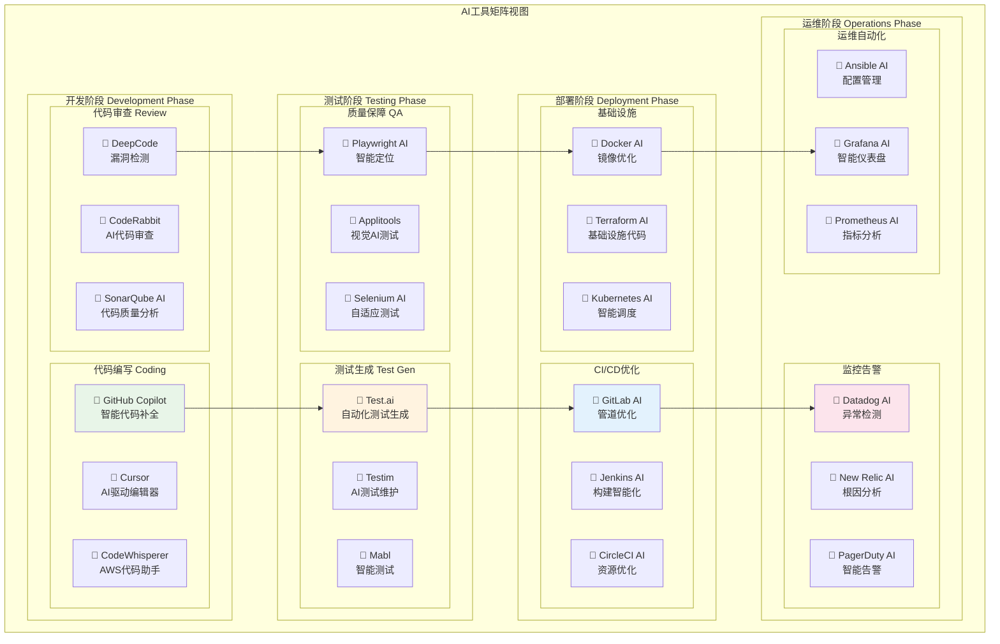

# AI DevOps 工具矩阵视图

## 概述
工具矩阵视图按DevOps流程阶段组织，详细列出各阶段可用的AI工具，便于工具选型和对比。

## 适用场景
- 工具选型和评估
- 团队培训和知识分享
- 制作工具清单和参考手册
- AI工具能力对比

## 图表

## 工具详细说明

### 开发阶段 (Development Phase)

#### 代码编写工具
| 工具 | 主要功能 | 优势 | 适用场景 |
|------|----------|------|----------|
| **GitHub Copilot** | 智能代码补全 | 大模型训练，支持多语言 | 日常开发，代码生成 |
| **Cursor** | AI驱动编辑器 | 原生AI集成，上下文理解 | 新项目开发，AI优先开发 |
| **CodeWhisperer** | AWS代码助手 | AWS生态集成，安全扫描 | AWS项目，企业级应用 |

#### 代码审查工具
| 工具 | 主要功能 | 优势 | 适用场景 |
|------|----------|------|----------|
| **CodeRabbit** | AI代码审查 | 自动化审查，详细建议 | 团队协作，代码质量 |
| **SonarQube AI** | 代码质量分析 | 全面质量检测，规则丰富 | 企业级质量管理 |
| **DeepCode** | 漏洞检测 | 安全问题发现，修复建议 | 安全要求高的项目 |

### 测试阶段 (Testing Phase)

#### 测试生成工具
| 工具 | 主要功能 | 优势 | 适用场景 |
|------|----------|------|----------|
| **Test.ai** | 自动化测试生成 | AI驱动，自适应测试 | 移动应用，Web应用 |
| **Testim** | AI测试维护 | 自修复测试，稳定性高 | 回归测试，UI测试 |
| **Mabl** | 智能测试 | 端到端测试，持续学习 | 复杂应用，集成测试 |

#### 质量保障工具
| 工具 | 主要功能 | 优势 | 适用场景 |
|------|----------|------|----------|
| **Applitools** | 视觉AI测试 | 视觉回归检测，跨平台 | UI测试，视觉验证 |
| **Selenium AI** | 自适应测试 | 元素智能定位，抗变化 | Web自动化测试 |
| **Playwright AI** | 智能定位 | 现代Web支持，并行执行 | 现代Web应用测试 |

### 部署阶段 (Deployment Phase)

#### CI/CD优化工具
| 工具 | 主要功能 | 优势 | 适用场景 |
|------|----------|------|----------|
| **GitLab AI** | 管道优化 | 集成度高，AI增强 | GitLab生态，DevOps平台 |
| **Jenkins AI** | 构建智能化 | 插件丰富，可扩展性强 | 传统CI/CD，复杂流程 |
| **CircleCI AI** | 资源优化 | 云原生，性能优化 | 云端构建，快速交付 |

#### 基础设施工具
| 工具 | 主要功能 | 优势 | 适用场景 |
|------|----------|------|----------|
| **Terraform AI** | 基础设施代码 | 多云支持，状态管理 | 基础设施即代码 |
| **Kubernetes AI** | 智能调度 | 容器编排，自动扩展 | 云原生应用 |
| **Docker AI** | 镜像优化 | 容器化，轻量级部署 | 应用容器化 |

### 运维阶段 (Operations Phase)

#### 监控告警工具
| 工具 | 主要功能 | 优势 | 适用场景 |
|------|----------|------|----------|
| **Datadog AI** | 异常检测 | 全栈监控，AI驱动 | 企业级监控 |
| **New Relic AI** | 根因分析 | APM专业，深度分析 | 应用性能监控 |
| **PagerDuty AI** | 智能告警 | 事故管理，智能分派 | 事故响应管理 |

#### 运维自动化工具
| 工具 | 主要功能 | 优势 | 适用场景 |
|------|----------|------|----------|
| **Ansible AI** | 配置管理 | 无代理，简单易用 | 配置自动化 |
| **Prometheus AI** | 指标分析 | 开源，灵活配置 | 指标监控 |
| **Grafana AI** | 智能仪表盘 | 可视化强，插件丰富 | 监控可视化 |

## 选型建议

### 企业级选型策略
1. **成熟度优先**: 选择经过市场验证的工具
2. **生态集成**: 考虑与现有工具链的集成度
3. **团队能力**: 匹配团队的技术水平和学习能力
4. **成本效益**: 综合考虑采购成本和维护成本

### 工具组合推荐
- **初创团队**: GitHub Copilot + Test.ai + GitLab AI + Datadog AI
- **中型企业**: Cursor + Testim + Jenkins AI + New Relic AI
- **大型企业**: 多工具组合，分场景使用

## 实施路径

1. **评估现状**: 分析当前工具链和痛点
2. **试点验证**: 选择1-2个工具进行小范围试点
3. **培训推广**: 团队培训和最佳实践分享
4. **全面推广**: 基于试点经验进行全面推广
5. **持续优化**: 根据使用反馈持续优化工具配置