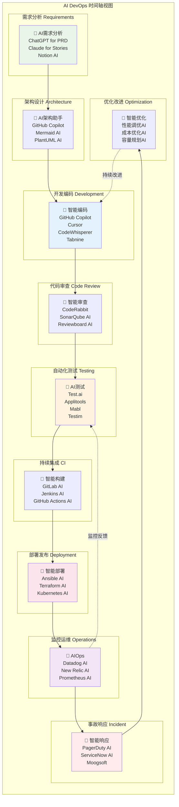

# AI DevOps 时间轴视图

## 概述
时间轴视图按照软件开发生命周期的自然顺序展示AI工具的应用，从需求分析到持续优化的完整流程。

## 适用场景
- 流程介绍和培训
- 新员工入职培训
- 完整DevOps流程展示
- AI应用全景介绍

## 图表

## 各阶段详细说明

### 1. 🎯 需求分析 (Requirements)
**目标**: 理解业务需求，生成技术方案

**AI工具应用**:
- **ChatGPT/Claude**: 
  - 需求澄清和分析
  - PRD文档生成
  - 用户故事编写
- **Notion AI**: 
  - 需求文档整理
  - 知识库构建
  - 项目规划辅助

**输出物**: 需求文档、用户故事、技术方案

### 2. 🏗️ 架构设计 (Architecture)
**目标**: 设计系统架构和技术选型

**AI工具应用**:
- **GitHub Copilot**: 
  - 架构代码框架生成
  - 设计模式建议
- **Mermaid AI**: 
  - 架构图自动生成
  - 流程图优化
- **PlantUML AI**: 
  - UML图智能生成
  - 系统设计可视化

**输出物**: 架构图、技术选型、设计文档

### 3. 💻 开发编码 (Development)
**目标**: 高效编写高质量代码

**AI工具应用**:
- **GitHub Copilot**: 
  - 实时代码补全
  - 函数生成
  - 注释自动生成
- **Cursor**: 
  - AI驱动的代码编辑
  - 自然语言转代码
- **CodeWhisperer**: 
  - AWS生态代码生成
  - 安全最佳实践建议
- **Tabnine**: 
  - 团队学习的代码补全
  - 个性化建议

**输出物**: 源代码、单元测试、技术文档

### 4. 🔍 代码审查 (Code Review)
**目标**: 确保代码质量和团队知识共享

**AI工具应用**:
- **CodeRabbit**: 
  - 自动代码审查
  - 潜在问题识别
  - 改进建议生成
- **SonarQube AI**: 
  - 代码质量分析
  - 技术债务评估
  - 安全漏洞检测
- **Reviewboard AI**: 
  - 审查流程自动化
  - 代码影响分析

**输出物**: 审查报告、修改建议、质量指标

### 5. 🧪 自动化测试 (Testing)
**目标**: 自动化质量保障和回归测试

**AI工具应用**:
- **Test.ai**: 
  - 测试用例自动生成
  - 智能测试执行
  - 结果分析
- **Applitools**: 
  - 视觉回归测试
  - 跨平台兼容性
- **Mabl**: 
  - 端到端测试自动化
  - 自适应测试维护
- **Testim**: 
  - AI驱动的测试稳定性
  - 智能元素定位

**输出物**: 测试报告、覆盖率分析、缺陷报告

### 6. 🔨 持续集成 (CI)
**目标**: 自动化构建和质量检查

**AI工具应用**:
- **GitLab AI**: 
  - 管道优化建议
  - 构建失败分析
  - 资源使用优化
- **Jenkins AI**: 
  - 智能构建调度
  - 插件推荐
  - 故障预测
- **GitHub Actions AI**: 
  - 工作流优化
  - 依赖管理
  - 安全扫描

**输出物**: 构建制品、质量报告、安全扫描结果

### 7. 🚀 部署发布 (Deployment)
**目标**: 安全可靠的生产环境部署

**AI工具应用**:
- **Ansible AI**: 
  - 配置管理自动化
  - 部署脚本生成
  - 环境一致性检查
- **Terraform AI**: 
  - 基础设施代码生成
  - 变更影响分析
  - 成本优化建议
- **Kubernetes AI**: 
  - 智能资源调度
  - 自动扩缩容
  - 故障自愈

**输出物**: 部署脚本、基础设施代码、发布报告

### 8. 📊 监控运维 (Operations)
**目标**: 确保系统稳定性和性能

**AI工具应用**:
- **Datadog AI**: 
  - 异常检测和告警
  - 性能分析
  - 容量预测
- **New Relic AI**: 
  - 应用性能监控
  - 用户体验分析
  - 根因分析
- **Prometheus AI**: 
  - 指标分析和预警
  - 趋势预测
  - 自动化响应

**输出物**: 监控仪表盘、性能报告、告警配置

### 9. 🚨 事故响应 (Incident)
**目标**: 快速定位和解决生产问题

**AI工具应用**:
- **PagerDuty AI**: 
  - 智能告警分发
  - 事故分类和优先级
  - 升级策略
- **ServiceNow AI**: 
  - 事故管理流程
  - 知识库搜索
  - 解决方案推荐
- **Moogsoft**: 
  - 事件关联分析
  - 噪音减少
  - 预测性告警

**输出物**: 事故报告、解决方案、改进计划

### 10. 🔄 优化改进 (Optimization)
**目标**: 持续优化系统和流程

**AI工具应用**:
- **性能调优AI**: 
  - 瓶颈识别
  - 优化建议
  - 效果评估
- **成本优化AI**: 
  - 资源使用分析
  - 成本节约建议
  - ROI评估
- **容量规划AI**: 
  - 负载预测
  - 扩容建议
  - 架构优化

**输出物**: 优化报告、改进计划、成本分析

## 关键特点

### 🔄 反馈循环
- **监控反馈**: 生产监控数据反馈到测试环节
- **问题反馈**: 事故和问题反馈到开发环节
- **持续改进**: 优化建议驱动下一轮开发

### ⏱️ 时间特性
- **并行执行**: 某些阶段可以并行进行
- **迭代循环**: 整个流程是循环迭代的
- **持续集成**: CI/CD实现了流程的自动化

### 🎯 价值递增
- **从需求到交付**: 每个阶段都增加业务价值
- **质量保障**: 多个阶段确保最终质量
- **风险控制**: 每个环节都有风险控制措施

## 实施建议

1. **分阶段实施**: 不要一次性引入所有AI工具
2. **重点突破**: 选择痛点最明显的阶段优先引入AI
3. **培训先行**: 确保团队具备使用AI工具的能力
4. **度量效果**: 建立指标体系衡量AI工具的效果
5. **持续优化**: 根据实际使用情况持续调整和优化