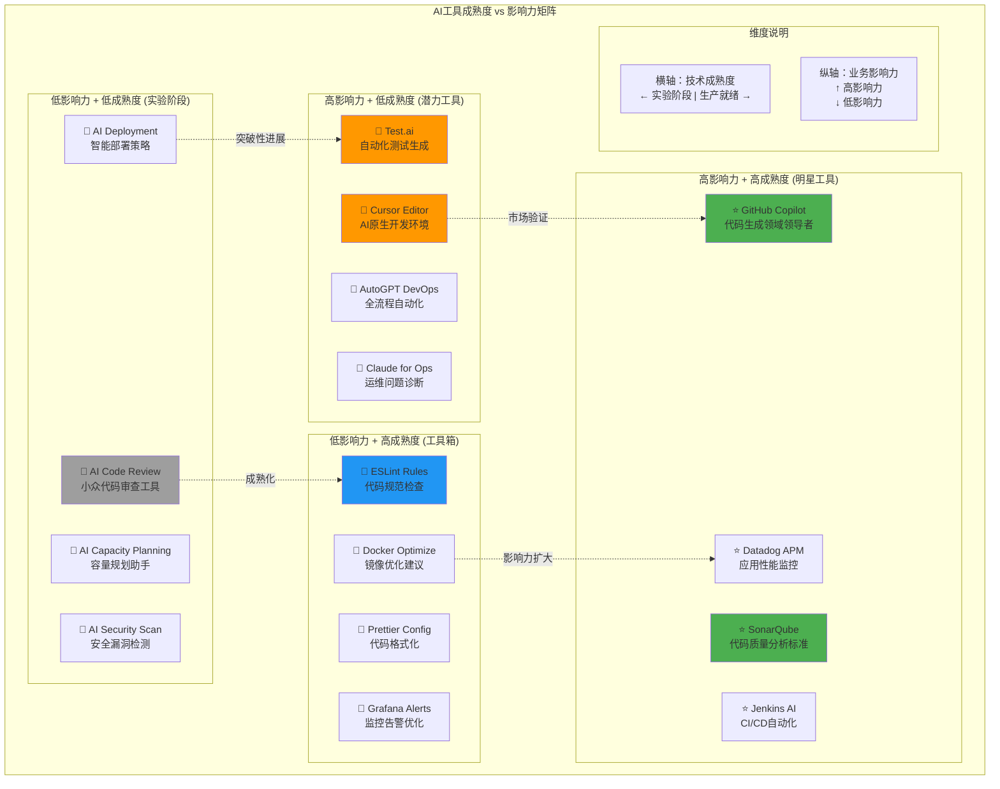

# AI DevOps 成熟度矩阵

## 概述
成熟度矩阵从技术成熟度和业务影响力两个维度评估AI工具，帮助企业制定投资优先级和技术路线图。

## 适用场景
- 投资决策和预算规划
- 技术路线图制定
- 工具采用优先级排序
- 管理层汇报和决策支持

## 图表

## 象限详细分析

### ⭐ 明星工具 (高影响力 + 高成熟度)
**投资策略**: 立即采用，全面推广

| 工具 | 成熟度评分 | 影响力评分 | 推荐指数 | 应用建议 |
|------|------------|------------|----------|----------|
| **GitHub Copilot** | 9/10 | 9/10 | ⭐⭐⭐⭐⭐ | 全员使用，标准配置 |
| **SonarQube** | 9/10 | 8/10 | ⭐⭐⭐⭐⭐ | 质量门禁必备 |
| **Datadog APM** | 8/10 | 9/10 | ⭐⭐⭐⭐⭐ | 生产监控首选 |
| **Jenkins AI** | 8/10 | 8/10 | ⭐⭐⭐⭐ | CI/CD核心组件 |

**特点**:
- ✅ 技术成熟，稳定可靠
- ✅ 业务价值明确，ROI高
- ✅ 市场认可度高，生态完善
- ✅ 有成功案例和最佳实践

### 🚀 潜力工具 (高影响力 + 低成熟度)  
**投资策略**: 重点关注，试点验证

| 工具 | 成熟度评分 | 影响力评分 | 潜力指数 | 风险评估 |
|------|------------|------------|----------|----------|
| **Cursor Editor** | 4/10 | 8/10 | 🚀🚀🚀🚀🚀 | 中等风险，高回报 |
| **Test.ai** | 5/10 | 7/10 | 🚀🚀🚀🚀 | 技术风险，但前景好 |
| **AutoGPT DevOps** | 3/10 | 9/10 | 🚀🚀🚀🚀🚀 | 高风险，革命性潜力 |
| **Claude for Ops** | 4/10 | 7/10 | 🚀🚀🚀🚀 | 新兴工具，需验证 |

**特点**:
- 🔥 革命性技术，颠覆潜力大
- ⚠️ 技术不够成熟，有风险
- 💡 创新性强，差异化优势
- 📈 快速迭代，发展前景好

### 🔧 工具箱 (低影响力 + 高成熟度)
**投资策略**: 标准配置，成本控制

| 工具 | 成熟度评分 | 影响力评分 | 实用指数 | 使用建议 |
|------|------------|------------|----------|----------|
| **ESLint Rules** | 9/10 | 4/10 | 🔧🔧🔧 | 基础工具，标准配置 |
| **Prettier Config** | 9/10 | 3/10 | 🔧🔧🔧 | 代码格式化必备 |
| **Docker Optimize** | 7/10 | 5/10 | 🔧🔧🔧🔧 | 镜像优化辅助 |
| **Grafana Alerts** | 8/10 | 5/10 | 🔧🔧🔧🔧 | 监控配置辅助 |

**特点**:
- ✅ 技术成熟，稳定可靠
- 📦 功能专一，解决特定问题
- 💰 成本较低，维护简单
- 🔧 辅助性工具，提升效率

### 🧪 实验阶段 (低影响力 + 低成熟度)
**投资策略**: 关注观察，谨慎试验

| 工具 | 成熟度评分 | 影响力评分 | 观察指数 | 投资建议 |
|------|------------|------------|----------|----------|
| **AI Code Review** | 3/10 | 4/10 | 🧪🧪 | 持续观察，暂不投入 |
| **AI Deployment** | 2/10 | 5/10 | 🧪🧪🧪 | 小范围试验 |
| **AI Capacity Planning** | 3/10 | 6/10 | 🧪🧪🧪 | 技术跟踪 |
| **AI Security Scan** | 4/10 | 4/10 | 🧪🧪 | 概念验证阶段 |

**特点**:
- 🔬 早期阶段，技术不成熟
- 💭 概念新颖，但价值未验证
- ⚠️ 投资风险高，回报不确定
- 👀 需要持续跟踪和观察

## 评估维度说明

### 技术成熟度 (横轴)
**评估标准**:
- **1-2分**: 概念阶段，技术原型
- **3-4分**: 早期产品，功能基础
- **5-6分**: 可用产品，需要完善
- **7-8分**: 成熟产品，生产就绪
- **9-10分**: 行业标准，广泛采用

**评估指标**:
- 产品稳定性和可靠性
- 功能完整性和易用性
- 文档和社区支持
- 市场采用度和案例
- 供应商支持和服务

### 业务影响力 (纵轴)
**评估标准**:
- **1-2分**: 微小改进，影响有限
- **3-4分**: 局部优化，特定场景
- **5-6分**: 明显改进，部分流程
- **7-8分**: 显著提升，核心流程
- **9-10分**: 革命性变化，全局影响

**评估指标**:
- 效率提升程度
- 质量改善效果
- 成本节约潜力
- 风险降低能力
- 用户体验改善

## 投资策略建议

### 🎯 投资优先级
1. **第一优先级**: 明星工具 - immediate ROI
2. **第二优先级**: 潜力工具 - 长期竞争优势
3. **第三优先级**: 工具箱 - 基础设施完善
4. **第四优先级**: 实验阶段 - 技术储备

### 💰 预算分配建议
- **明星工具**: 60% 预算，快速推广
- **潜力工具**: 25% 预算，试点验证
- **工具箱**: 10% 预算，标准配置
- **实验阶段**: 5% 预算，技术跟踪

### 📊 实施路线图

#### Q1: 基础建设
- 部署明星工具
- 建立基础设施
- 团队培训启动

#### Q2: 试点验证
- 选择潜力工具试点
- 收集使用数据
- 优化工具配置

#### Q3: 扩展应用
- 成功试点全面推广
- 集成工具箱工具
- 建立最佳实践

#### Q4: 持续优化
- 评估投资效果
- 调整工具组合
- 规划下年度投资

## 风险控制

### 🛡️ 风险识别
- **技术风险**: 新技术不稳定，可能影响生产
- **投资风险**: 工具投入成本高，ROI不确定
- **人员风险**: 团队学习成本，抵触情绪
- **安全风险**: AI工具可能带来数据安全问题

### 🔒 缓解措施
- **分阶段实施**: 降低技术风险
- **试点验证**: 控制投资风险  
- **培训支持**: 降低人员风险
- **安全审计**: 确保数据安全

## 持续评估

### 📈 定期评估机制
- **季度评估**: 工具使用效果和用户反馈
- **半年评估**: 成熟度和影响力变化
- **年度评估**: 投资回报和策略调整

### 🔄 动态调整
- 根据技术发展调整成熟度评分
- 根据业务价值调整影响力评分
- 根据市场变化调整投资策略