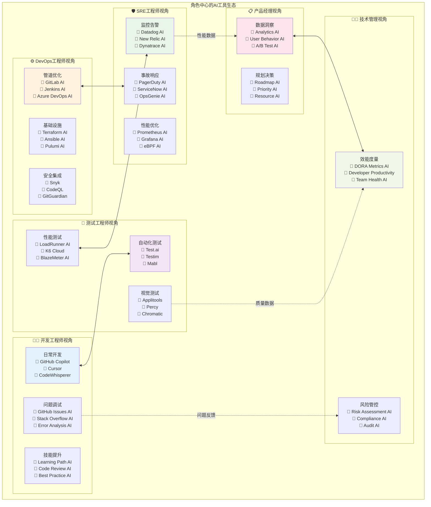

# AI DevOps 角色中心视图

## 概述
角色中心视图从不同角色的工作视角出发，展示每个角色在DevOps流程中如何使用AI工具，促进跨团队理解和协作。

## 适用场景
- 团队培训和能力建设
- 职责划分和协作优化
- 角色转型和技能发展
- 组织变革和文化建设

## 图表

## 角色详细分析

### 👨‍💻 开发工程师 (Developer)

#### 核心职责
- 功能开发和代码实现
- 单元测试和代码调试
- 技术方案设计和实现
- 代码质量和可维护性

#### AI工具应用场景

**日常开发**
| 工具 | 使用场景 | 价值体现 | 使用频率 |
|------|----------|----------|----------|
| **GitHub Copilot** | 代码补全、函数生成 | 提升编码速度50% | 每天 |
| **Cursor** | AI驱动编程、自然语言转代码 | 降低编程门槛 | 每天 |
| **CodeWhisperer** | AWS服务集成、最佳实践 | 云原生开发 | 按需 |

**问题调试**
| 工具 | 使用场景 | 价值体现 | 使用频率 |
|------|----------|----------|----------|
| **GitHub Issues AI** | Bug分析、解决方案搜索 | 快速定位问题 | 按需 |
| **Stack Overflow AI** | 技术问题搜索、最佳实践 | 学习效率提升 | 每周 |
| **Error Analysis AI** | 错误日志分析、根因定位 | 问题排查效率 | 按需 |

**技能提升**
| 工具 | 使用场景 | 价值体现 | 使用频率 |
|------|----------|----------|----------|
| **Learning Path AI** | 个性化学习推荐 | 技能发展规划 | 每月 |
| **Code Review AI** | 代码审查学习 | 编程能力提升 | 每周 |
| **Best Practice AI** | 最佳实践推荐 | 代码质量改善 | 按需 |

### 🧪 测试工程师 (QA Engineer)

#### 核心职责
- 测试用例设计和执行
- 自动化测试框架建设
- 质量保障和风险控制
- 测试流程优化

#### AI工具应用场景

**自动化测试**
| 工具 | 使用场景 | 价值体现 | 使用频率 |
|------|----------|----------|----------|
| **Test.ai** | 测试用例自动生成 | 测试覆盖率提升 | 每天 |
| **Testim** | UI测试自动化 | 测试稳定性改善 | 每天 |
| **Mabl** | 端到端测试 | 用户体验保障 | 每天 |

**视觉测试**
| 工具 | 使用场景 | 价值体现 | 使用频率 |
|------|----------|----------|----------|
| **Applitools** | 视觉回归测试 | UI一致性保障 | 每次发布 |
| **Percy** | 视觉差异检测 | 前端质量控制 | 每次发布 |
| **Chromatic** | 组件视觉测试 | 组件库质量 | 持续 |

**性能测试**
| 工具 | 使用场景 | 价值体现 | 使用频率 |
|------|----------|----------|----------|
| **LoadRunner AI** | 性能测试分析 | 性能瓶颈识别 | 每周 |
| **K6 Cloud** | 负载测试自动化 | 性能监控 | 持续 |
| **BlazeMeter AI** | 性能测试优化 | 测试效率提升 | 按需 |

### ⚙️ DevOps工程师 (DevOps Engineer)

#### 核心职责
- CI/CD流水线建设和维护
- 基础设施自动化
- 工具链集成和优化
- 安全和合规保障

#### AI工具应用场景

**管道优化**
| 工具 | 使用场景 | 价值体现 | 使用频率 |
|------|----------|----------|----------|
| **GitLab AI** | CI/CD管道优化 | 构建效率提升 | 每天 |
| **Jenkins AI** | 构建任务智能化 | 资源利用优化 | 每天 |
| **Azure DevOps AI** | 流水线分析 | 交付速度提升 | 每天 |

**基础设施**
| 工具 | 使用场景 | 价值体现 | 使用频率 |
|------|----------|----------|----------|
| **Terraform AI** | 基础设施代码生成 | IaC效率提升 | 每周 |
| **Ansible AI** | 配置管理自动化 | 环境一致性 | 每周 |
| **Pulumi AI** | 云资源管理 | 多云部署优化 | 按需 |

**安全集成**
| 工具 | 使用场景 | 价值体现 | 使用频率 |
|------|----------|----------|----------|
| **Snyk** | 依赖安全扫描 | 安全风险控制 | 持续 |
| **CodeQL** | 代码安全分析 | 漏洞提前发现 | 每次提交 |
| **GitGuardian** | 密钥泄露检测 | 安全合规保障 | 持续 |

### 🛡️ SRE工程师 (SRE Engineer)

#### 核心职责
- 系统可靠性保障
- 性能监控和优化
- 事故响应和恢复
- 容量规划和扩展

#### AI工具应用场景

**监控告警**
| 工具 | 使用场景 | 价值体现 | 使用频率 |
|------|----------|----------|----------|
| **Datadog AI** | 异常检测和预警 | 故障提前发现 | 持续 |
| **New Relic AI** | 应用性能分析 | 性能优化指导 | 每天 |
| **Dynatrace AI** | 全栈监控分析 | 根因快速定位 | 持续 |

**事故响应**
| 工具 | 使用场景 | 价值体现 | 使用频率 |
|------|----------|----------|----------|
| **PagerDuty AI** | 智能告警分发 | 响应效率提升 | 持续 |
| **ServiceNow AI** | 事故管理自动化 | 处理流程优化 | 按需 |
| **OpsGenie AI** | 值班调度优化 | 人员负载均衡 | 持续 |

**性能优化**
| 工具 | 使用场景 | 价值体现 | 使用频率 |
|------|----------|----------|----------|
| **Prometheus AI** | 指标分析和预测 | 容量规划支持 | 每天 |
| **Grafana AI** | 仪表盘智能化 | 可视化效果提升 | 每天 |
| **eBPF AI** | 系统性能深度分析 | 性能瓶颈精确定位 | 按需 |

### 📋 产品经理 (Product Manager)

#### 核心职责
- 产品需求分析和规划
- 用户体验设计和优化
- 数据驱动决策
- 产品路线图制定

#### AI工具应用场景

**数据洞察**
| 工具 | 使用场景 | 价值体现 | 使用频率 |
|------|----------|----------|----------|
| **Analytics AI** | 用户行为分析 | 产品优化方向 | 每天 |
| **User Behavior AI** | 用户体验洞察 | 功能优先级确定 | 每周 |
| **A/B Test AI** | 实验设计和分析 | 功能效果验证 | 按需 |

**规划决策**
| 工具 | 使用场景 | 价值体现 | 使用频率 |
|------|----------|----------|----------|
| **Roadmap AI** | 产品路线图规划 | 战略规划支持 | 每月 |
| **Priority AI** | 需求优先级排序 | 资源配置优化 | 每周 |
| **Resource AI** | 资源需求预测 | 团队规模规划 | 每月 |

### 👨‍💼 技术管理者 (Tech Manager)

#### 核心职责
- 团队效能监控和提升
- 技术风险识别和控制
- 资源配置和人员发展
- 技术战略制定

#### AI工具应用场景

**效能度量**
| 工具 | 使用场景 | 价值体现 | 使用频率 |
|------|----------|----------|----------|
| **DORA Metrics AI** | DevOps效能分析 | 团队改进方向 | 每周 |
| **Developer Productivity** | 开发效率分析 | 流程优化建议 | 每周 |
| **Team Health AI** | 团队健康度评估 | 组织发展规划 | 每月 |

**风险管控**
| 工具 | 使用场景 | 价值体现 | 使用频率 |
|------|----------|----------|----------|
| **Risk Assessment AI** | 技术风险评估 | 决策支持 | 每月 |
| **Compliance AI** | 合规检查自动化 | 合规风险控制 | 持续 |
| **Audit AI** | 审计流程自动化 | 审计效率提升 | 按需 |

## 跨角色协作模式

### 🤝 协作关系

**开发 ↔ 测试**
- 共享代码质量指标
- 协同自动化测试建设
- 问题反馈和修复循环

**测试 ↔ SRE**
- 性能测试数据共享
- 质量指标联合监控
- 生产问题联合分析

**DevOps ↔ SRE**
- 部署流程协同优化
- 监控告警配置协作
- 事故响应流程设计

**产品 ↔ 管理**
- 效能数据共享分析
- 产品目标与技术指标对齐
- 资源投入产出分析

### 📊 数据流转

**性能数据流**: SRE → 产品经理
- 系统性能指标
- 用户体验数据
- 可用性统计

**问题反馈流**: 开发 → 技术管理
- 开发过程中的问题
- 技术债务统计
- 工具使用反馈

**质量数据流**: 测试 → 技术管理
- 质量指标趋势
- 测试覆盖率数据
- 缺陷统计分析

## 角色转型建议

### 🔄 技能发展路径

**开发工程师**
- **AI辅助编程**: 熟练使用AI编程工具
- **全栈思维**: 了解测试和运维基础知识
- **质量意识**: 重视代码质量和可维护性

**测试工程师**
- **AI测试**: 掌握AI驱动的测试自动化
- **数据分析**: 提升数据分析和洞察能力
- **用户视角**: 加强用户体验和业务理解

**DevOps工程师**
- **平台工程**: 向平台工程师角色发展
- **AI运维**: 掌握AIOps相关技术
- **云原生**: 深入云原生技术栈

**SRE工程师**  
- **预测性运维**: 利用AI进行故障预测
- **自动化运维**: 提升运维自动化水平
- **业务理解**: 加强对业务的理解

### 📚 学习建议

**通用技能**
- AI工具使用和优化
- 数据分析和可视化
- 自动化脚本开发
- 云原生技术理解

**协作技能**
- 跨角色沟通协作
- 数据驱动决策
- 持续改进思维
- 用户中心理念

## 组织发展建议

### 🏢 组织结构优化
- **跨职能团队**: 打破角色壁垒，组建跨职能小队
- **平台团队**: 建立平台工程团队，提供基础设施服务
- **CoE团队**: 建立AI应用卓越中心，推广最佳实践

### 📈 能力建设
- **培训体系**: 建立系统化的AI工具培训体系
- **最佳实践**: 收集和分享AI应用最佳实践
- **创新激励**: 鼓励团队尝试新的AI工具和方法

### 🎯 文化建设
- **学习型组织**: 鼓励持续学习和技能更新
- **数据驱动**: 培养基于数据做决策的文化
- **协作共赢**: 强调跨团队协作和共同目标